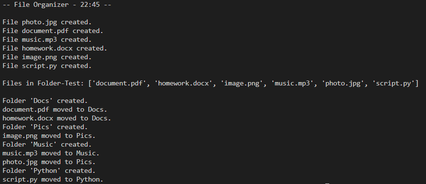

# File Organizer



A Python application that automatically organizes files into folders based on their file extensions.

## Overview

This application scans a folder and automatically sorts files into different directories based on their file extensions.

For example:

```text
photo.jpg      → Images/
document.pdf   → Documents/
music.mp3      → Music/
script.py      → Python/
```

If a destination folder does not exist, it is created automatically before moving the file.

## Features

- Organizes files by extension.
- Automatically creates destination folders.
- Uses Python dictionaries to map file types.
- Ignores unsupported file types safely.
- Works with common file extensions.

## Technologies

- Python 3
- Standard Library:
  - os
  - shutil

## Project Structure

```
file-organizer/
│
├── file_organizer.py
├── README.md
├── LICENSE
└── .gitignore
```

## How to Run

Clone the repository:

```bash
git clone https://github.com/leosialer-18/file-organizer.git
```

Move into the project folder:

```bash
cd file-organizer
```

Run the application:

```bash
python file_organizer.py
```

## What I Learned

During this project I practiced:

- Working with files and directories.
- Using dictionaries to automate tasks.
- Creating reusable functions.
- Managing paths with `os.path`.
- Moving files with `shutil`.
- Using Git and GitHub for version control.

## Future Improvements

- Allow users to choose the source folder.
- Add support for additional file extensions.
- Improve error handling.
- Create a graphical user interface.
- Package the application as an executable.

## Author

Leonardo Sialer Gonzales

First-year ASIR (Network Systems Administration) student interested in Microsoft systems, automation and cybersecurity.